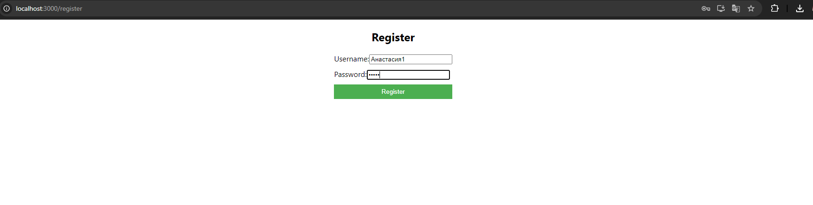

## Инструкция для пользователя ##

1\. При запуске приложения пользователю открывается экран авторизации.
Если пользователь не зарегистрирован, то он может это сделать, нажав по кнопке "Registration"

Для него откроется окно с вводом логина и пароля в самом простом варианте. 

Конечно, при доработке в будущем нас будет интересовать повышение безопасности (добавление дополнительных требований к паролям и начилие поля для повторного ввода) и сбор дополнительной информации о клиенте.

Если пароль или логин введены неправильно для входа в систему после регистрации, то высветится надпись "Invalid username or password"

2\. Когда пользователь вошел в систему, он попадает на главный экран, основную страницу сайта.

В верхнем левом углу расположена кнопка Logout для выхода из системы.

Ниже находится поисковая строка, разбитая на поля Город, Штат, Индекс и Радиус соответственно. При вводе текста в поисковую строку поиск начинает происходить автоматически, исходя из набронного текста. Если требуется сбросить настройки набранного поиска, то сбоку расположена зеленая кнопка Reset.

Исключение: функция с поиском по радиусу не доработана (пожалуйста, примите без нее хотя бы на удовл)

Основная информация по рынкам высвечивается в виде имени, города, штата и рейтинга с разбивкой по страницам. Пользователь может отсортировать данные по этим полям, нажав по кнопкам под названиями полей: asc и desc соответсвенно по возрастанию и убыванию.

Когда пользователь нашел нужный ему рынок, он может нажать на кнопку View Details, чтобы ознакомиться с информацией о рынке подробнее и написать отзыв.

Если какой-то рынок перестал существовать и требуется удалить данные о нем из системы, то пользователь может нажать на зеленую кнопку Delete в разделе Actions. В этом случае запись будет удалена.

3\. После перехода по кнопке View Details высвечивается следующая форма:

 

Тут пользователь может ознакомиться с отзывами других пользователей о рынке, а также добавить свой, выбрав оценку от 1 до 5 звезд и написав необязательеый текст рецензии.

 

После окончания работы со страницей, пользователь может вернуться на главную страницу. Для этого нужно нажать на кнопку Back в левом верхнем углу.